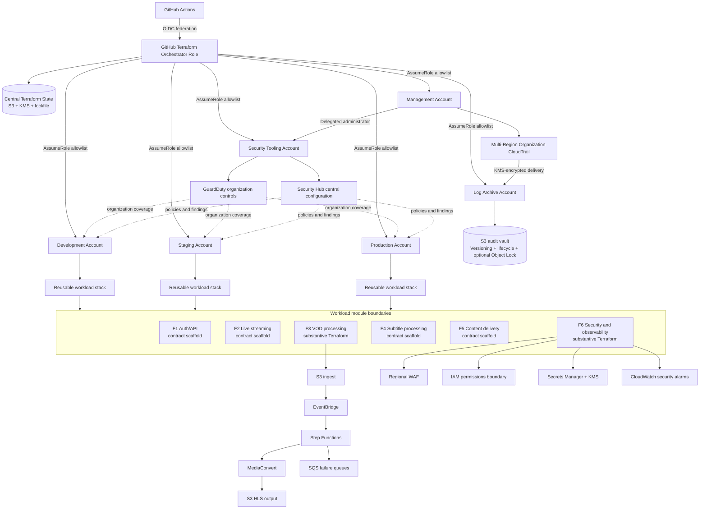

# Security-First AWS Multi-Account Media Platform

## Portfolio case study

**Project type:** Terraform reference architecture prototype  
**Target roles:** Cloud Security Engineer, Cybersecurity Engineer, Cloud Engineer, Solutions Architect  
**Primary technologies:** AWS Organizations, IAM, Security Hub, GuardDuty, CloudTrail, S3, KMS, WAF, Secrets Manager, Step Functions, EventBridge, MediaConvert, SQS, CloudWatch, Terraform, GitHub Actions OIDC

> Status statement: This repository demonstrates an implementation-ready reference architecture. The Terraform control-plane resources, F3 VOD pipeline, and F6 security baseline contain substantive resource definitions. F1, F2, F4, and F5 currently define module contracts and roadmap boundaries rather than complete service implementations. The platform has not been claimed as deployed or production-certified.

---

## Executive summary

I designed a security-first AWS media-platform reference architecture that separates governance, security operations, audit retention, CI/CD tooling, and application workloads across dedicated AWS accounts.

The project addresses a common cloud-engineering problem: a media platform may begin as a single AWS account with locally managed IAM roles, logs, and Terraform state, but this model becomes difficult to govern as development, staging, production, and security responsibilities grow. A compromise in one workload account can also expose deployment credentials, audit logs, or organization-wide administrative capabilities when these functions are not separated.

The proposed architecture introduces:

- dedicated management, Terraform tooling, security tooling, log archive, development, staging, and production account boundaries;
- delegated GuardDuty and Security Hub administration;
- a centralized KMS-encrypted CloudTrail archive with versioning, lifecycle controls, and optional S3 Object Lock;
- GitHub Actions federation through IAM OIDC instead of long-lived access keys;
- explicit cross-account deployment-role allowlists;
- reusable workload composition for environment parity;
- IAM permission boundaries, regional WAF controls, Secrets Manager metadata, and centralized security outputs;
- an event-driven VOD workflow using S3, EventBridge, Step Functions, MediaConvert, SQS, and CloudWatch.

The result is a portfolio-grade prototype that demonstrates cloud-security architecture, Terraform modularity, least-privilege identity design, centralized auditability, and production-oriented account separation.

---

## Problem statement

A media company needs to support video ingestion, transcoding, subtitles, live streaming, application APIs, content delivery, and security monitoring. Building every function inside one AWS account creates several risks:

1. **Large blast radius.** A compromised deployment identity may reach production workloads, security services, logs, and state files.
2. **Weak audit independence.** Administrators who manage workloads could also alter or delete the logs used to investigate their actions.
3. **Environment drift.** Development, staging, and production can diverge when each environment is maintained separately.
4. **Credential exposure.** Static CI access keys create rotation, storage, and incident-response problems.
5. **Inconsistent security controls.** Security Hub, GuardDuty, IAM boundaries, WAF policies, and encryption may be configured differently across accounts and Regions.
6. **Terraform state risk.** State can include sensitive infrastructure metadata and must be encrypted, versioned, locked, and narrowly accessible.

The design objective was therefore not only to model a media workload, but to create the surrounding security and governance system required to operate it responsibly.

---

## Architecture goals

- Minimize the blast radius of workload, CI/CD, security, and audit identities.
- Remove long-lived AWS credentials from GitHub Actions.
- Centralize findings and audit logs without centralizing all privileges.
- Apply consistent controls across dev, staging, and production.
- Preserve a clear separation between organization governance and day-to-day security operations.
- Make destructive or organization-wide features opt-in through explicit Terraform variables.
- Keep the architecture reusable and understandable to reviewers.
- Avoid claiming deployment maturity that is not supported by evidence.

---

## Architecture diagram

### Trust boundaries

- **Management account:** organization-level delegation, service control policies, and organization trail ownership only.
- **Terraform tooling account:** OIDC provider, centralized state, and CI orchestration identity.
- **Security tooling account:** delegated GuardDuty and Security Hub administration.
- **Log archive account:** protected audit-log storage and KMS key ownership.
- **Workload accounts:** isolated dev, staging, and production service deployments.

---

## Key implementation areas

### 1. Security tooling account

The security account uses two AWS provider contexts:

- a security-account provider for detectors, aggregation, central configuration, and policies;
- a management-account provider limited to delegated-administrator registration.

Implemented Terraform resources include GuardDuty delegated administration, a GuardDuty detector, organization-wide member auto-enablement, selected GuardDuty features, Security Hub delegated administration, a finding aggregator, central organization configuration, an AWS Foundational Security Best Practices policy, and target associations.

This design follows the principle that the management account should delegate operational security rather than host routine security tooling.

### 2. Centralized audit vault

The log-archive module creates:

- a customer-managed KMS key with rotation;
- a CloudTrail-specific KMS policy constrained by source ARN and encryption context;
- an S3 bucket with versioning and public-access blocking;
- KMS default encryption;
- optional Object Lock with Governance or Compliance mode;
- lifecycle movement to Glacier and Deep Archive;
- seven-year default expiration controls;
- bucket policies for CloudTrail ACL checks and organization-log delivery;
- optional read/decrypt access for dedicated audit roles.

The organization-trail root obtains the bucket, prefix, and KMS key from remote state and verifies that the prepared CloudTrail ARN matches the management account, partition, Region, and trail name before creating the trail.

### 3. GitHub Actions OIDC orchestration

The tooling design creates an IAM OIDC provider for GitHub and a dedicated orchestration role. The trust policy requires:

- the `sts.amazonaws.com` audience;
- exact, allowlisted GitHub `sub` claims;
- `AssumeRoleWithWebIdentity` rather than static IAM access keys.

The orchestration role is limited to:

- approved Terraform state prefixes;
- the state KMS key;
- an explicit set of destination deployment-role ARNs.

This provides a two-hop identity chain:

1. GitHub Actions receives temporary credentials for the tooling-account orchestrator role.
2. Terraform assumes the delegated deployment role in the required destination account.

### 4. Environment parity

A reusable `workload-stack` composition module wires the F1–F6 boundaries consistently. Development, staging, and production roots can use the same graph while changing controls such as log retention and destructive bucket behavior.

Production-oriented defaults include `force_destroy = false` and longer log retention. The account providers also use `allowed_account_ids` to reduce the chance of deploying to an unintended account.

### 5. VOD processing flow

The F3 module models an event-driven VOD pipeline:

1. A media file is written to an S3 ingestion location.
2. EventBridge matches supported object-created events.
3. Step Functions orchestrates a MediaConvert job.
4. MediaConvert generates HLS outputs in a separate S3 bucket.
5. SQS queues capture workflow and event-delivery failures.
6. CloudWatch logging and alarms provide operational visibility.
7. IAM roles separate EventBridge, Step Functions, and MediaConvert responsibilities.

The module is the most complete application flow in the repository, but it should still pass a final Terraform/provider validation and deployment test before being described as operational.

### 6. Security baseline module

The F6 module provides reusable platform controls:

- AWS WAFv2 regional ACL with AWS managed rule groups and a rate-based rule;
- optional WAF associations and logging;
- IAM permission-boundary policy output;
- Secrets Manager secret metadata without storing plaintext secret values in Terraform;
- a KMS key or externally supplied key;
- a secret-reader policy;
- security-oriented CloudWatch alarms.

A permissions boundary defines the maximum possible permissions of roles that adopt it; it does not grant permissions by itself. This makes it suitable as a guardrail shared by workload modules.

---

## Security decisions and rationale

| Decision | Security rationale | Trade-off |
| --- | --- | --- |
| Separate tooling, security, logs, and workloads | Limits blast radius and separates duties | More accounts and bootstrap steps |
| OIDC instead of static CI keys | Temporary credentials and claim-based trust | Requires careful GitHub subject configuration |
| Explicit target-role allowlist | Prevents the CI role assuming arbitrary roles | New accounts require a controlled policy update |
| Central Security Hub configuration | Reduces security-control drift across accounts and Regions | Requires organization integration and home-Region planning |
| Dedicated log archive account | Workload administrators cannot normally control audit storage | Cross-account bucket and KMS policies are more complex |
| S3 Object Lock optional by variable | Supports WORM-style retention while allowing safe testing | Compliance mode can create irreversible retention obligations |
| Environment composition module | Reduces dev/staging/prod drift | Shared module changes affect multiple environments |
| Permission boundaries | Caps effective role permissions | Boundary and identity policy must both be maintained |
| Feature flags for org-wide controls | Prevents accidental organization changes | Requires a deliberate enablement sequence |

---

## Threat model and control mapping

| Threat | Control |
| --- | --- |
| Stolen CI secret | No long-lived AWS access keys; GitHub OIDC temporary credentials |
| Repository or workflow from an unapproved context | Exact GitHub OIDC subject-claim allowlist |
| CI attempts to deploy to an arbitrary account | Explicit destination-role ARN allowlist and provider `allowed_account_ids` |
| Workload admin deletes audit history | Audit logs stored in a separate account with versioning and optional Object Lock |
| CloudTrail delivery redirected | Bucket and KMS policies constrained to the expected trail ARN |
| Security-control drift across accounts | Security Hub central configuration and organization policies |
| Excessive workload role permissions | Shared permissions boundary plus role-specific policies |
| Malicious or accidental web requests | WAF managed rules and rate limiting |
| Pipeline failure silently drops events | EventBridge DLQ, workflow failure queue, CloudWatch alarms |
| Plaintext application secrets committed to state | Secret value intentionally excluded from Terraform resources |

---

## Validation strategy

The repository currently contains a Terraform formatting and validation workflow for selected roots and modules. A production-quality validation plan should include:

1. `terraform fmt -check -recursive`.
2. `terraform init -backend=false` and `terraform validate` for every root and reusable module.
3. Static security checks such as Checkov, tfsec, or Trivy configuration scanning.
4. Terraform provider lockfiles committed per root.
5. Pull-request plans using read-only or planning permissions.
6. Manual approval through GitHub Environments before production apply.
7. Saved-plan application so the approved plan is the plan that is executed.
8. Scheduled drift detection using `terraform plan -detailed-exitcode`.
9. Sandbox deployment tests for irreversible features such as Object Lock and organization policies.
10. CloudTrail delivery-status verification after organization-trail activation.

### Evidence-based project status

| Area | Status |
| --- | --- |
| Multi-account architecture and account roots | Implemented in Terraform |
| Security Hub and GuardDuty delegated control plane | Implemented in Terraform; deployment not evidenced |
| Log archive S3/KMS/Object Lock controls | Implemented in Terraform; deployment not evidenced |
| Organization CloudTrail binding | Implemented behind an opt-in flag; deployment not evidenced |
| GitHub OIDC orchestrator IAM module | Implemented in Terraform; workflow integration not yet fully evidenced |
| F3 VOD processing | Substantive Terraform implementation; final validation/deployment testing required |
| F6 security baseline | Substantive Terraform implementation; final validation/deployment testing required |
| F1/F2/F4/F5 services | Contract scaffolds and roadmap boundaries |
| CI/CD | Validation workflow exists; full gated plan/apply/drift workflows remain a documented next milestone |

---

## Challenges and learning

### Cross-account bootstrapping

A destination role cannot assume itself into existence. I separated the one-time account bootstrap step from routine CI/CD. Temporary administrative access creates the initial delegated role; afterward, normal deployments use OIDC and cross-account role assumption.

### Circular trust and state dependencies

The state backend and CI role are foundational resources used by other roots. They require a bootstrap sequence and cannot depend on the remote state they are creating. The design therefore separates backend creation, account bootstrap, and normal environment deployments.

### CloudTrail policy coordination

The organization trail is owned in the management account while the bucket and KMS key live in the log-archive account. The trail name, Region, account ID, partition, S3 prefix, bucket policy, and KMS policy must align. I added a Terraform precondition that compares the expected trail ARN with the value prepared by the log-archive state.

### Honest portfolio scoping

A common portfolio mistake is presenting a scaffold as a deployed product. I documented implementation status at module level and described incomplete functions as contracts or roadmap items. This makes the project defensible during technical interviews.

---

## Outcomes

This project demonstrates the ability to:

- translate security principles into AWS account boundaries and IAM trust relationships;
- design delegated administration for organization-wide security services;
- protect audit evidence with independent ownership, encryption, versioning, lifecycle, and retention controls;
- replace static cloud credentials with workload identity federation;
- design least-privilege cross-account Terraform orchestration;
- build event-driven media workflows with failure handling and observability;
- structure Terraform into reusable modules and environment compositions;
- communicate limitations, operational prerequisites, and deployment sequence clearly.

---

## Resume-ready bullets

- Designed a Terraform-based AWS multi-account media-platform reference architecture separating management, CI/CD tooling, security operations, audit retention, and dev/staging/prod workloads to reduce blast radius and enforce separation of duties.
- Implemented delegated GuardDuty and Security Hub organization controls, including centralized findings, organization auto-enablement, and AWS Foundational Security Best Practices policy associations.
- Engineered a centralized CloudTrail audit vault using cross-account S3 policies, customer-managed KMS encryption, versioning, lifecycle transitions, and optional S3 Object Lock with seven-year retention defaults.
- Built a GitHub Actions OIDC orchestration model that removes static AWS credentials and restricts CI to approved Terraform state prefixes, KMS usage, and explicit cross-account deployment roles.
- Developed an event-driven VOD processing module using S3, EventBridge, Step Functions, MediaConvert, SQS dead-letter queues, and CloudWatch observability.
- Created reusable security guardrails with AWS WAF managed rules, IAM permission boundaries, Secrets Manager integration, KMS encryption, and CloudWatch alarms.

---

## Repository walkthrough

A reviewer should examine the project in this order:

1. `infrastructure/landing-zone/README.md` — account model and deployment sequence.
2. `infrastructure/landing-zone/modules/github-oidc-orchestrator/` — CI trust and least-privilege orchestration.
3. `infrastructure/landing-zone/accounts/security-tooling/` — delegated security administration.
4. `infrastructure/landing-zone/modules/log-archive/` and `accounts/log-archive/` — audit vault.
5. `infrastructure/landing-zone/organization-trail/` — final audit binding.
6. `infrastructure/landing-zone/modules/workload-stack/` — environment composition.
7. `infrastructure/modules/f3-vod-processing/` — event-driven media pipeline.
8. `infrastructure/modules/f6-security-observability/` — reusable security baseline.

---

## Next milestones

- Correct and validate all F3 state-machine/provider details against the pinned AWS provider.
- Add matrix-based CI validation for every Terraform root and reusable module.
- Implement PR plan, environment-gated apply, saved-plan verification, and scheduled drift workflows.
- Deploy into a sandbox AWS Organization using non-production accounts.
- Capture `terraform plan`, CloudTrail delivery, GuardDuty membership, Security Hub policy, and Object Lock evidence.
- Implement the F1 Auth/API, F2 live-streaming, F4 subtitle-processing, and F5 content-delivery resources.
- Add security scanning, policy-as-code, cost estimates, and automated documentation.

---

## Reference architecture basis

The design follows official AWS and Terraform concepts for Security Hub central configuration, organization CloudTrail trails, IAM OIDC federation, and S3-backed Terraform state with lockfiles. These references guide the architecture; they do not constitute evidence that this repository has been deployed.
